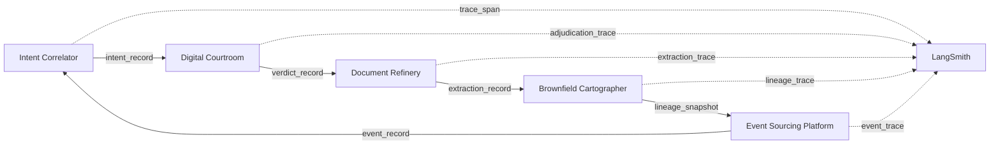

# Data Contract Enforcer - Interim Report Submission

# Chalie Lijalem

## Overview

This interim report summarizes the current contract posture of the Week 7 Data Contract Enforcer project across the five connected systems in the broader workflow: Intent Correlator, Digital Courtroom, Document Refinery, Brownfield Cartographer, and Event Sourcing Platform. It also captures the role of LangSmith as the cross-cutting observability layer used to trace prompts, outputs, and downstream execution paths.

The goal of this project is not only to move data between systems, but to make those handoffs explicit, testable, and dependable. The main shift is from informal compatibility (“the payload seems to work”) to formal certainty (“the payload matches a declared contract and is actively validated”).

## Data Flow Diagram

## Contract Coverage Table

| Interface | Producer | Consumer | Contract Status | Reason |
|---|---|---|---|---|
| `intent_record` | Intent Correlator | Digital Courtroom | Partial | Interface is conceptually defined, but not yet represented in this repository as a generated Bitol contract artifact. |
| `verdict_record` | Digital Courtroom | Document Refinery | Partial | Downstream expectations are understood, but coverage is still narrative rather than fully enforced through a committed contract file here. |
| `extraction_record` | Document Refinery | Brownfield Cartographer | Yes | Week 3 extraction outputs are now normalized, profiled, and covered by generated Bitol and dbt YAML contracts plus validator checks. |
| `lineage_snapshot` | Brownfield Cartographer | Event Sourcing Platform | Partial | Generator lineage injection supports this interface, but lineage coverage is lighter than the main Week 3 / Week 5 contract path. |
| `event_record` | Event Sourcing Platform | Intent Correlator | Yes | Week 5 event outputs are contract-generated, mapped into dbt schema tests, and validated with structural, type, range, and drift checks. |
| `trace_span` / observability payloads | All systems | LangSmith | No | LangSmith is integrated as the observability destination, but those trace payloads are not yet formalized as explicit repository-level contracts in this project. |

## Validation Results

The first real validation run summarized here is based on `validation_reports/cd04520a-44e8-4814-bb20-34b118c1f503.json`, generated from `generated_contracts/week3_extractions.yaml` against `outputs/week3/extractions.jsonl`. That run executed **49 total checks**. **48 checks passed**, **1 check warned**, and there were **0 failures** and **0 errors**. Overall, this indicates that the Week 3 extraction dataset is structurally healthy: required fields were present, declared types matched the contract, and bounded numeric fields such as `extracted_facts__confidence` and `language_confidence` remained inside the expected `0.0-1.0` range.

The one non-pass result was a real statistical drift warning on `extracted_facts__value`. The ValidationRunner reported `drift.mean_vs_baseline` with `status: WARNING`, `severity: WARNING`, and `failing_record_count: 89`. The recorded baseline mean for that field was `341.25`, while the current mean was `33.859551`, producing a drift of `307.390449`. That exceeded the warning threshold of `259.771534` (two standard deviations) but did not cross the critical threshold of `389.657301` (three standard deviations). In other words, the runner correctly identified a meaningful distribution shift without overstating it as a hard failure.

This result is useful because it shows the validator is not limited to obvious schema breakage. Structural checks would not catch a change in the shape of numeric values if the field still existed and still parsed. The runner’s two-layer approach is what makes the difference: range validation enforces explicit field bounds, while drift validation compares current behavior to the stored baseline in `schema_snapshots/baselines.json`. During development, that same mechanism was designed to catch issues such as a confidence field drifting from a `0.0-1.0` probability scale to a `0-100` percentage scale. In the actual Week 3 run, the observed warning appeared on `extracted_facts__value` rather than `confidence`, but the lesson is the same: the ValidationRunner can surface silent data shifts before they become downstream analytical errors.

## Reflection

Writing formal contracts for this project exposed how many assumptions my earlier systems were making without ever naming them. Before this work, several interfaces depended on a kind of tribal knowledge: developers and pipelines “knew” what a record should look like, but that expectation lived in code paths, prompt habits, naming conventions, and downstream tolerance rather than in a declared contract. The most obvious example was identifier handling. In theory, a UUID field sounds simple, but in practice earlier systems often treated identifiers as whatever was convenient at the moment: sometimes a UUID-looking string, sometimes a document slug, sometimes a nested object carrying more metadata than the consumer actually expected. That ambiguity was tolerable while the systems were small and loosely coupled, but the moment I tried to formalize the interfaces, the hidden variability became visible.

The same thing happened with numeric semantics. A confidence field was not just a number; it was a number with a meaning, scale, and downstream consequence. Without a contract, a value of `95` and a value of `0.95` can both pass through a pipeline as “valid numbers,” even though they imply radically different certainty. Once I started generating contracts and enforcing range plus drift checks, I realized that previous success criteria were too weak. “The script runs” is not the same as “the data is trustworthy.” The formal contract forced me to define what trustworthy actually means.

The Brownfield Cartographer from Week 4 feels like the most vulnerable system to upstream changes. Its job depends on interpreting outputs from other systems and turning them into lineage understanding. That means even small upstream schema shifts can have oversized downstream effects. If extraction identifiers change format, if event payloads rename fields, or if a producer starts omitting a field that was never formally declared required, the Cartographer can quietly produce incomplete or misleading lineage. It sits in the middle of the dependency graph, so it absorbs instability from both sides.

That is why the biggest mental shift in this project has been moving from “it runs” to “it’s certain.” Contracts, migration rules, validation reports, and preflight checks all contribute to that certainty. They do not eliminate change, but they turn change into something visible, reviewable, and governable. For me, that is the real value of the Data Contract Enforcer project.
